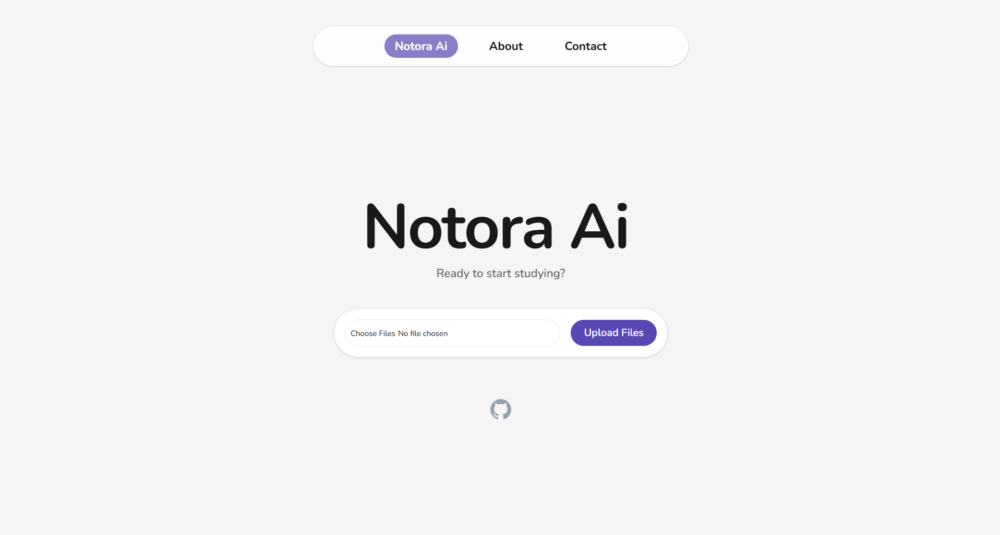

Notora AI is an intelligent study companion designed to transform static study materials into interactive, conversational learning experiences. By leveraging advanced AI, Notora allows you to upload your lecture notes, textbooks, and documents to instantly generate context-aware summaries, explanations, and Q&A sessions.

## Main Features:
- **Intelligent Document Parsing:** Upload PDFs and text files and let the AI analyze the core concepts.
- **Conversational Learning:** Ask questions about your material in plain language and receive precise, academic-focused answers.
- **Math & Science Support:** Built-in support for LaTeX and KaTeX rendering, ensuring that complex formulas and scientific notation are displayed clearly.
- **Modern, Minimalist UI:** A distraction-free interface built with React, Tailwind CSS, and Framer Motion for smooth, intuitive navigation.
- **Persistent Context:** The AI remembers the context of your specific notes, allowing for deep dives into complex topics.

## Tech Stack:
Frontend: React.js, Tailwind CSS, Framer Motion
Backend: Node.js, Express, Axios
Math/Text Rendering: React-Markdown, Remark-Math, Rehype-Katex

## How to Setup:
Follow these steps to run Notora AI locally on your machine.

Prerequisites
- Node.js (v16 or higher)
- npm or yarn

### Installation
1. Clone the repository:
```
git clone https://github.com/your-username/notora-ai.git
cd notora-ai
```

2. Install dependencies:
```
npm install
```

3. Set up environment variables:
Create a .env file in the root directory and add your API keys:
```
PORT=5000
# Add your AI service API key here
```

4. Start the development server:
```
npm run dev
```

## How to Use
When you launch the program, you will be greeted by the Notora landing screen.

Click "Upload Files" to select your study notes or course documents.

Once the upload is processed, you will be transitioned to the chat interface.

Type your questions into the input bar at the bottom and hit "Ask" to start the conversation!

## Contributing
Contributions are welcome! If you have suggestions for new features or find a bug, please feel free to open an issue or submit a pull request.

## License
This project is licensed under the MIT License - see the LICENSE file for details.
